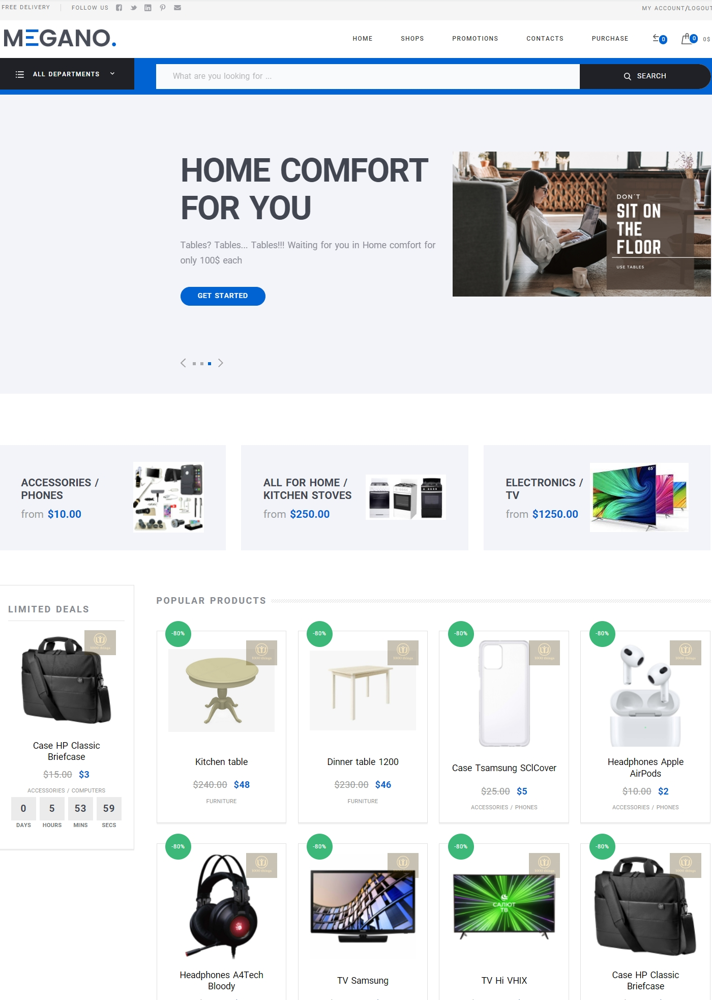

# Интернет-магазин MEGANO


## Структура проекта
### Проект состит из следующих частей
1. Приложения:
 - `banners_app` - небольшое приложение по генерации баннеров для главной страницы;
 - `discounts_app` - приложение системы скидок магазина;
 - `goods_app` - приложение товаров магазина;
 - `orders_app` - приложение заказов, а также содержит сервисы сравнения, просмотренных товаров, корзины, и оплата
   товаров;
 - `profiles_app` - приложение пользователей и личного кабинета;
 - `payments_app` - вспомогательное api-приложение для сервиса оплаты;
 - `settings_app` - приложение с настройками сайта, кэша, со скриптами, служебными функциями и сервисами;
 - `stores_app` - приложение продавцов и товаров продавцов, а также кабинет продавцов;
2. Директории шаблонов:
 - `templates`;
3. Документация:
 - `Readme` - директория документации;
 - `Requirements` - директория зависимостей;
4. Служебные директории:
 - `fixtures` - фикстуры с тестовыми данными для заполнения сайта контентом;
 - `locale` - файлы интернационализации;
 - `static` - статичные файлы сайта;
 - `uploads` - директория для загружаемых моделями файлов;
5. Системные и служебные файлы:
 - `config` - директория настроек django-проекта;
 - `env.template` - шаблон для заполнения файла настроек .env;
 - `urls.xlsx` - url-структура сайта;
 - прочие файлы и настройки проекта;

Документация по каждому из приложений расположена в директории `Readme`.

## Установка проекта
Для установки исходника интернет магазина необходимо ввести следующую команду:
```
git clone https://gitlab.skillbox.ru/learning_materials/python_django_team5.git
```
Чтобы проект работал корректно, необходимо установить зависимости командой:
```
git install -r requirements/requirements.txt
```
В случае если нужно установить зависимости для доработки, правки, или последующей разработки, следует использовать команду:
```
git install -r requirements/dev_requirements.txt
```
После Того, как все зависимости будут установлены, необходимо создать и заполнить файл виртуального окружения `.env` по образцу `env.template`.

Если вы хотите посмотреть структуру всех ссылок и страниц, необходимо ввести команду:
```
python manage.py import_url
```
В результате этой команды в корневой директории проекта будет создан(или перезаписан, если таковой уже имеется) excel-файл с таблицей ссылок и страниц.

Следующим шагом будет создание суперпользователя для управления и доступа в админ-панель. Сделать это можно командой:
```
python manage.py createsuperuser
```
Также предусмотрена возможность заполнения проекта тестовыми данными с использованием скрипта `loadscript`:
```
python manage.py loadscript no_clear
```
При этом будут созданы 5 пользователей со следующими данными:

Логин для входа        | Пароль | Группа |
-----------------|-----------------|---------------|
admin@example.com  |   123456   |   superuser|
user@test.com     |   qawsed12   |    Продавец|
test2@user.com      |   Qerk1212   |    Продавец|
test3@user.com      |   Qerk1212   |               |
manager@user.com      |   Qerk1212   |      Контент-менеджер|

Более подробно узнать о функциях скрипта можно в файле Readme/loadscript.md 
> ### Примечание:
> При заполнении проекта тестовыми данными нет необходимости вызывать команду createsuperuser, так как таковой уже имеется в тестовых данных. 

Запуск обработки асинхронных задач:
```
redis-server
celery -A config worker -l INFO -P gevent
celery -A config beat -l INFO --scheduler django_celery_beat.schedulers:DatabaseScheduler
```
